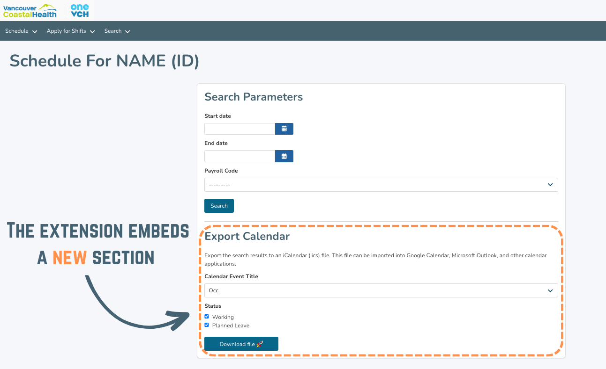

# VCH MySchedule Exporter - Google Chrome Extension

VCH MySchedule Exporter is a Google Chrome Extension that exports your work shifts from Vancouver Coastal Health (VCH) MySchedule into an iCalendar (.ics) file. 

Link: <link>

# Why would I use it?
Vancouver Coastal Health (VCH) MySchedule currently doesn't provide a way to export work shifts. With the help of this extension, you are able to easily export work shifts into events in your personal calendar (Google Calendar, Microsoft Outlook, Apple Calendar, etc.). 

# How do I use it?
## Step 1: Export the calendar as iCal
1. Download the extension: <link>
2. Log in to [VCH MySchedule](https://myschedule.vch.ca/employee/) 
3. Click "Schedule" > "My Shifts"
4. In the Search Parameters section, select the search parameters
5. Click "Search"
6. In the Export Calendar section, select the export settings
7. Click "Download file". This will download a file: `vch-my-schedule.ics`
8. Go to your calendar (Google Calendar, Microsoft Outlook, Apple Calendar etc.) and import `vch-my-schedule.ics`

## Step 2: Import iCal to personal calendar
### Google Calendar
1. Open Google Calendar
2. Near the top right, click Settings (gear icon) > "Settings"
3. In the menu on the left, click "Import & Export"
4. Under the "Import" section, click "Select file from your computer"
5. Select the downloaded file: `vch-my-schedule.ics`
6. Choose which calendar to add the imported events to
7. By default, events are imported into your primary calendar
8. Click Import

Reference: https://support.google.com/calendar/answer/37118

### Apple Calendar
1. Open Apple Calendar
2. Click "File" > "Import"
3. Select the downloaded file: `vch-my-schedule.ics`
4. Select the calendar to add the events to, then click "OK"

Reference: https://support.apple.com/en-ca/guide/calendar/icl1023

### Microsoft Outlook
1. Open Microsoft Outlook
2. Select "File" > "Open & Export" > "Import/Export"
3. In Import and Export Wizard box, select "Import an iCalendar (.ics) or vCalendar file (.vcs)",and then "Next"
4. Select the downloaded file: `vch-my-schedule.ics` and click "OK"
5. Select "Open as New"

Reference: https://support.microsoft.com/en-us/office/import-calendars-into-outlook-8e8364e1-400e-4c0f-a573-fe76b5a2d379

# How does it work?
The extension will detect if your browser is on the "My Shifts" page in VCH MySchedule. Once you are on the page, it will embed an "Export Calendar" section. Once you click the "Download file" button, it will loop through the shifts in the search results and create calendar events for each shift in an exported iCalendar (.ics) file.

# How would I run it locally?
## Loading the extension for the first time
1. Open Google Chrome and go to the menu (three dots in the top right corner)
2. Extensions -> Manage Extensions
3. Turn on "Developer mode" in the top right corner
4. Click on "Load unpacked" in the top left corner
5. Select the folder where the extension files are located and click "Select"
6. Find the extension in the Extensions dropdown (puzzle piece)

## Updating the extension
1. Make the necessary changes to your extension's code
2. Save the changes to the files
3. Go to the menu (three dots in the top right corner) and select "More tools" and then "Extensions"
4. Find the extension in the list and click the "Update" button
5. Select the folder where the updated extension files are located and click "Select"

## Console log for background worker
1. Go to Chrome Extensions page (chrome://extensions/)
2. Click Extension "Details"
3. Under "Inspect views" -> Click service worker

# What can be improved?
## Exclude event description
By default, the extension will include all event details in the description. The extension could include a setting that allows the user to exclude the details.
