# Instructions

## Step 1: Export the calendar as iCal
#### 1. Download the extension [from the Chrome Web Store](https://chrome.google.com/webstore/detail/vch-myschedule-exporter/cnlicejghdbkkjbnlihjmijbhkcmeikk)
#### 2. Log in to [VCH MySchedule](https://myschedule.vch.ca/employee/) 
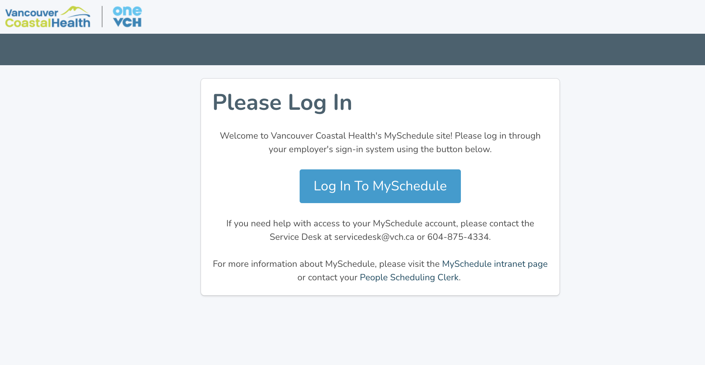
#### 3. Click "Schedule" > "My Shifts"
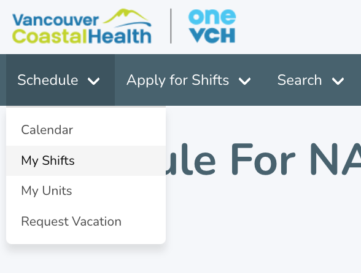
#### 4. In the Search Parameters section, select the search parameters. Click "Search".
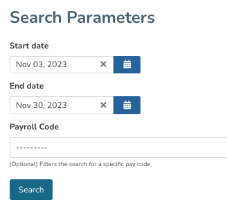
#### 5. In the Export Calendar section, select the export settings. Click "Download file".
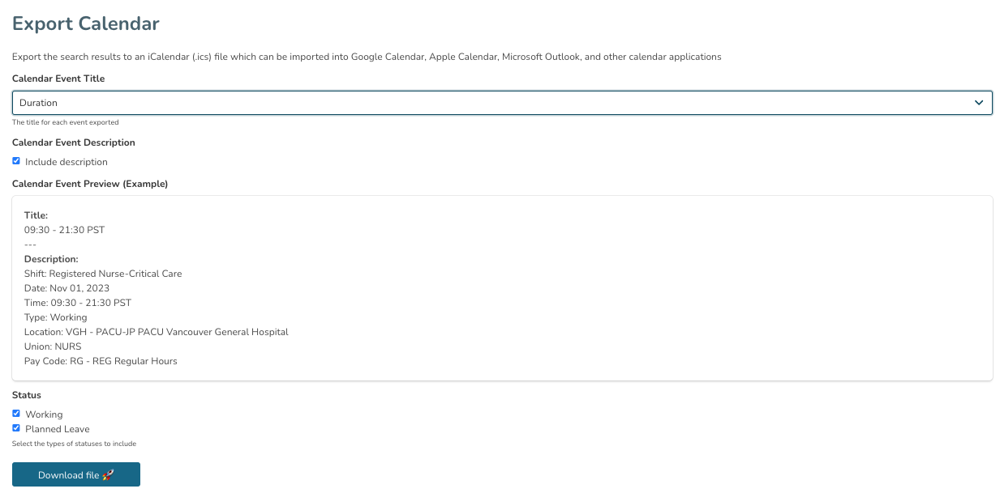
#### 6. A popup will notify you that the export is about to start. Click "OK". The page will reload several times and then download a file: `vch-my-schedule.ics`
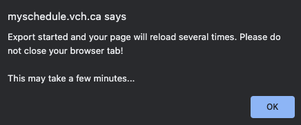
#### 7. Go to your personal calendar (Google Calendar, Apple Calendar, Outlook Calendar, etc.) and import `vch-my-schedule.ics` into a new calendar. See instructions in the section below.

## Step 2: Import iCal to personal calendar
> ⚠️ **_WARNING:_**
> Once you import `vch-my-schedule.ics`, there currently isn't a way to remove all events that were imported. Therefore, it is highly recommended that you create a new calendar as the import destination that is different from your daily calendar. 

In your personal calendar, find the import button and select `vch-my-schedule.ics`. Below are the instructions to import for:
- [Google Calendar](#google-calendar)
- [Apple Calendar](#apple-calendar)
- [Outlook Calendar](#outlook-calendar)

### Google Calendar
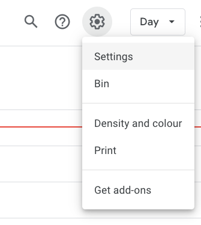

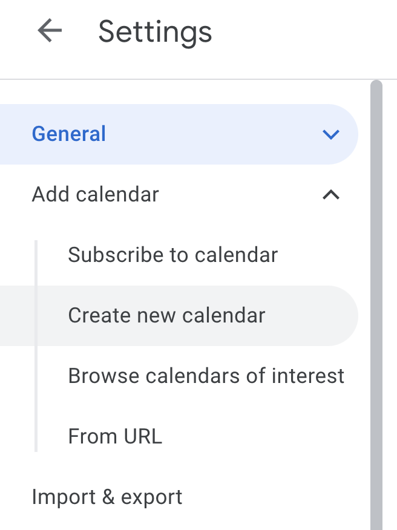

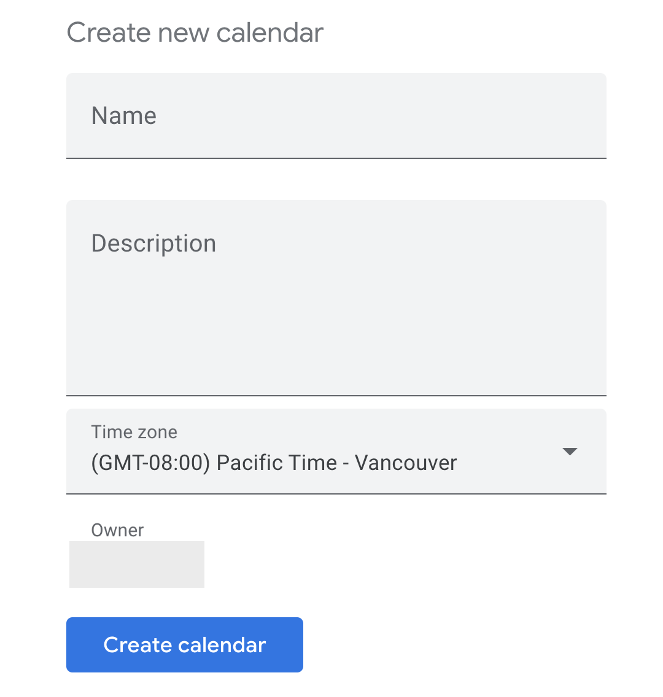

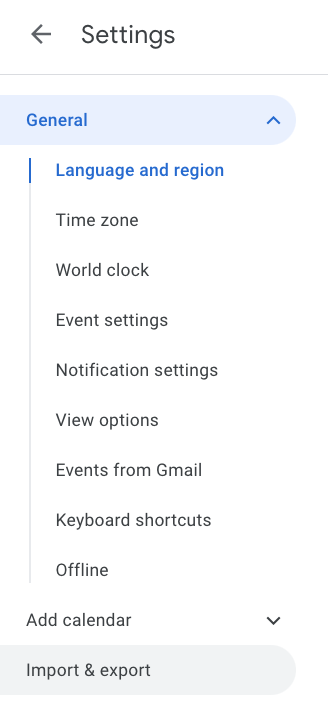

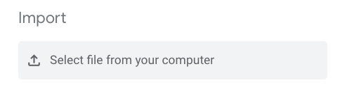
1. Open Google Calendar
2. Near the top right, click Settings (gear icon) > "Settings"
3. In the menu on the left, click "Add Calendar" -> "Create new calendar"
4. Enter your calendar details, then click "Create calendar"
5. In the menu on the left, click "Import & Export" -> "Import"
6. Click "Select file from your computer"
7. Select the downloaded file: `vch-my-schedule.ics`
8. Choose the newly created calendar from step 4 to add the imported events
9. Click Import

Reference: https://support.google.com/calendar/answer/37118

### Apple Calendar
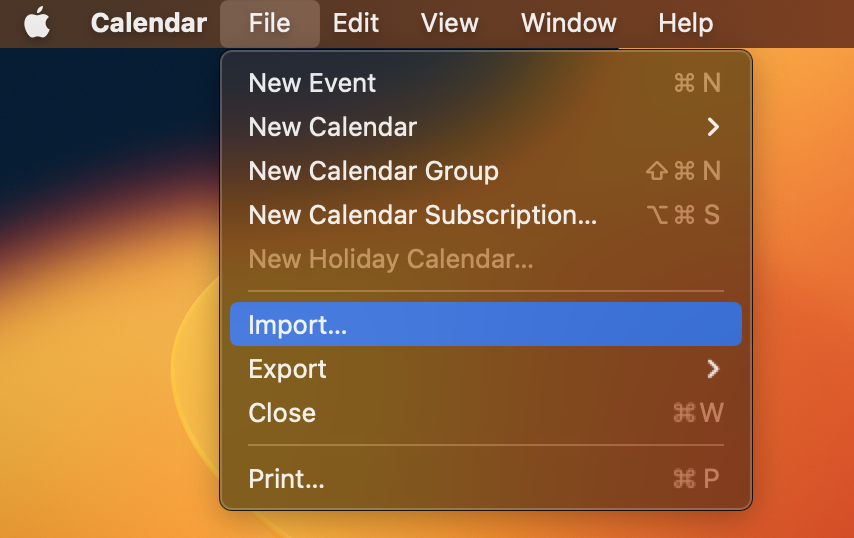

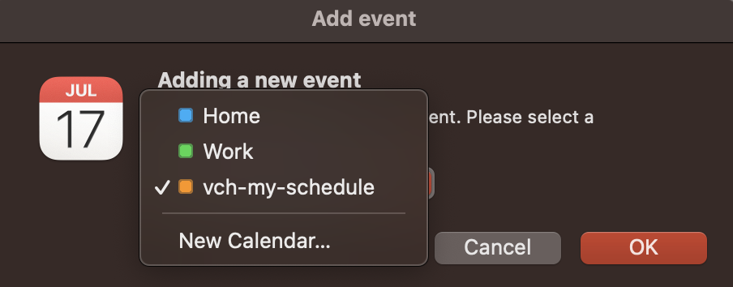

1. Open Apple Calendar
2. Click "File" > "Import"
3. Select the downloaded file: `vch-my-schedule.ics`. An "Add event" tab will appear
4. In the dropdown -> click "New Calendar..." -> OK

Reference: https://support.apple.com/en-ca/guide/calendar/icl1023

### Outlook Calendar
1. Open Microsoft Outlook
2. Select "File" > "Open & Export" > "Import/Export"
3. In Import and Export Wizard box, select "Import an iCalendar (.ics) or vCalendar file (.vcs)",and then "Next"
4. Select the downloaded file: `vch-my-schedule.ics` and click "OK"
5. Select "Open as New"

Reference: https://support.microsoft.com/en-us/office/import-calendars-into-outlook-8e8364e1-400e-4c0f-a573-fe76b5a2d379
